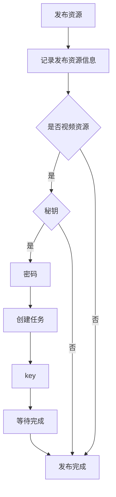

## 资源发布流程图

```mermaid
graph TB
PUBLISH[发布资源]-->ADDROW
ADDROW[记录发布资源信息]-->ISVIDEO
ISVIDEO{是否视频资源}--是-->ENCENABLED
ENCENABLED{秘钥}--是-->PASSWD
PASSWD[密码]-->JOB
JOB[创建任务]-->KEYURL
KEYURL[key]-->WAIT
WAIT[等待完成]-->COMPLETE[发布完成]
ISVIDEO--否-->COMPLETE
ENCENABLED--否-->COMPLETE
```

## 其它

> 命名取自神话故事 Under the Rose 中的沉默之神 - 哈伯克拉底
>
> 维纳斯在一次与情人幽会时，被沉默之神哈勃克拉底撞见。丘比特为了维护其母维纳斯的声誉，送给哈勃克拉底一朵玫瑰，请求他别把这事张扬出去，哈勃克拉底接受了玫瑰花后便缄默不语。

